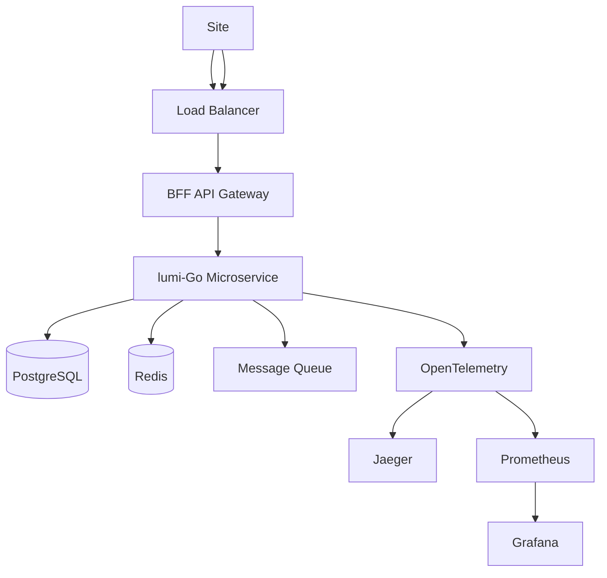

# lumi-go Documentation

Welcome to the lumi-go (Go Microservice Template) documentation.

## 📚 Documentation Index

### Getting Started
- **[Quick Start](./quickstart.md)** - Get running in 5 minutes
- **[Engineering Setup](./engineering.md)** - Complete toolchain installation
- **[Development Guide](./development.md)** - Detailed development workflow

### Core Components
- **[Observability](./observability.md)** - Logging, metrics, and tracing
- **[Logging Contract](./logging.md)** - Structured logging standards
- **[Metrics Guide](./metrics.md)** - Prometheus metrics and dashboards
- **[Database Migrations](./migrations.md)** - Schema management
- **[Docker Setup](./docker.md)** - Container configuration
- **[Helm Charts](./helm.md)** - Kubernetes deployment

### Reference
- **[Tools Reference](./tools.md)** - Complete guide to all tools
- **[Architecture Decisions](./adr/)** - ADR records

### Project Documentation
- **[README](../README.md)** - Project overview
- **[Contributing](../CONTRIBUTING.md)** - Contribution guidelines
- **[Security](../SECURITY.md)** - Security policy
- **[License](../LICENSE)** - MIT License

## 🚀 Start Here

New to the project? Follow this path:

1. **[Quick Start](./quickstart.md)** - Get the application running
2. **[Engineering Setup](./engineering.md)** - Install all tools
3. **[Development Guide](./development.md)** - Learn the workflow
4. **[Tools Reference](./tools.md)** - Deep dive into tools

## 🛠️ Key Commands

```bash
# Verify your setup
./scripts/verify-setup.sh

# Start everything
make up

# Run application
make run

# Run tests
make test

# View help
make help
```

## 📂 Project Structure

```
lumi-go/
├── docs/                 # All documentation (centralized)
│   ├── quickstart.md     # Quick start guide
│   ├── engineering.md    # Setup instructions
│   ├── development.md    # Development workflow
│   ├── tools.md          # Tools reference
│   ├── observability.md  # Observability guide
│   ├── logging.md        # Logging contract
│   ├── migrations.md     # Database migrations
│   ├── docker.md         # Docker setup
│   ├── helm.md           # Helm charts
│   └── adr/              # Architecture decisions
├── tests/                # All tests (centralized)
│   └── observability/    # Observability tests
│       └── logger/       # Logger tests
├── cmd/server/           # Application entry point
├── internal/             # Business logic
├── api/                  # API definitions
├── migrations/           # Database schema files
├── deploy/               # Deployment configs
├── scripts/              # Utility scripts
└── Makefile              # Build automation
```

## 🔧 Tool Versions

| Tool | Required Version |
|------|-----------------|
| Go | 1.22+ |
| Docker | 24.0+ |
| Docker Compose | 2.23+ |
| kubectl | 1.28+ |
| Helm | 3.13+ |

See [engineering.md](./engineering.md) for complete list.

## 📊 Service Endpoints

| Service | URL | Purpose |
|---------|-----|---------|
| API | http://localhost:8080 | Main application |
| gRPC | http://localhost:8081 | RPC endpoints |
| Metrics | http://localhost:9090/metrics | Prometheus metrics |
| Grafana | http://localhost:3000 | Dashboards (admin/admin) |
| Jaeger | http://localhost:16686 | Distributed tracing |

## 🏗️ Architecture Overview



## 🧪 Testing Strategy

- **Unit Tests** - Business logic validation
- **Integration Tests** - Component interaction
- **E2E Tests** - Full workflow validation
- **Performance Tests** - Load and stress testing
- **Security Tests** - Vulnerability scanning

## 🔒 Security

- JWT-based authentication
- Role-based access control (RBAC)
- Rate limiting
- Input validation
- Secret scanning
- Container scanning
- Dependency scanning

See [Security Policy](../SECURITY.md) for details.

## 📈 Observability

### Metrics
- Request rate, error rate, duration (RED)
- CPU, memory, disk, network usage
- Business metrics

### Logging
- Structured JSON logging
- Correlation IDs
- Log aggregation

### Tracing
- Distributed tracing with OpenTelemetry
- Span correlation
- Performance insights

## 🤝 Contributing

See [Contributing Guide](../CONTRIBUTING.md) for:
- Code style guidelines
- Commit conventions
- PR process
- Testing requirements

## 📞 Support

- **Documentation:** This directory
- **Issues:** [GitHub Issues](https://github.com/lumitut/lumi-go/issues)
- **Discussions:** [GitHub Discussions](https://github.com/lumitut/lumi-go/discussions)
- **Email:** platform@lumitut.com

## 📝 License

This project is licensed under the MIT License - see [LICENSE](../LICENSE) file.

---

**Need help?** Start with the [Quick Start Guide](./quickstart.md) or run `make help`.
